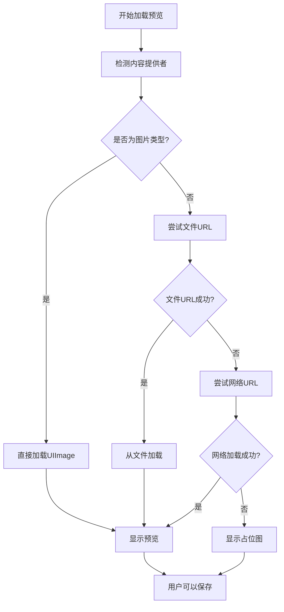

# 🔗 Share Extension 技术文档

本文档详细说明 ShakeDraw 分享扩展的实现原理、技术细节和优化策略。

## 📋 概述

ShakeDraw Share Extension 允许用户从任何 iOS 应用（Safari、相册、社交媒体等）直接将图片保存到 ShakeDraw 的图片库中。扩展支持多种图片格式，具备智能预览功能和强大的网络图片处理能力。

## 🏗️ 架构设计

### 核心组件

```
Share to ShakeDraw/
├── ShareViewController.swift    # 主控制器（~950行代码）
├── Info.plist                  # 扩展配置
├── MainInterface.storyboard    # UI界面
└── Share to ShakeDraw.entitlements  # 权限配置
```

### 主要功能模块

1. **内容类型检测** - 识别和处理多种输入类型
2. **智能预览系统** - 异步加载预览图片
3. **网络图片处理** - 优化处理网页分享
4. **多格式支持** - 支持7+种图片格式
5. **异步状态管理** - 确保准确的用户反馈

## 🔧 技术实现

### 1. 内容类型检测

支持三种主要的内容类型：

```swift
// UTType.image - 直接的图片数据
// UTType.fileURL - 文件URL引用  
// UTType.url - 网络URL（用于Safari分享）
```

**检测策略**：
- 优先处理直接图片附件
- 回退到文件URL处理
- 最后尝试网络URL处理

### 2. 智能预览系统

#### 预览加载流程


#### 关键优化
- **超时机制**：8秒智能超时，避免无限等待
- **并发处理**：多个provider并发尝试，提高成功率
- **缓存策略**：网络请求优先使用缓存
- **图片缩放**：预览图自动缩放到300px以内

### 3. 网络图片处理

#### HEAD请求优化
```swift
private func checkContentType(for url: URL, completion: @escaping (Bool) -> Void) {
    var request = URLRequest(url: url)
    request.httpMethod = "HEAD"  // 只获取头部信息
    
    // 检查 Content-Type 是否为图片
    let isImage = contentType.hasPrefix("image/")
}
```

**优势**：
- 避免下载完整内容进行检测
- 快速确定URL是否指向图片
- 节省带宽和处理时间

#### Content-Type智能识别
支持多种MIME类型映射：
```swift
image/jpeg → .jpg
image/png → .png  
image/webp → .webp
image/heic → .heic
image/gif → .gif
image/bmp → .bmp
image/tiff → .tiff
```

### 4. 异步状态管理

#### 问题解决
**原问题**：保存成功但UI显示"保存失败"
**根本原因**：异步回调时序问题，`DispatchGroup.leave()`调用时机错误

**解决方案**：
```swift
// 修复前（错误）
defer { group.leave() }  // 在异步回调之前执行

// 修复后（正确）  
asyncOperation { result in
    // 处理结果
    group.leave()  // 在异步回调完成后执行
}
```

### 5. 错误处理和用户反馈

#### 占位图系统
当预览加载失败时，自动生成优雅的占位图：
```swift
private func createPlaceholderImage() -> UIImage {
    // 使用 UIGraphicsImageRenderer 创建
    // 包含图标和文字的占位图
}
```

#### 详细调试日志
生产环境保持简洁，开发环境提供详细信息：
```swift
print("🔍 尝试加载预览，支持的类型：")
print("📸 检测到图片URL，直接下载") 
print("✅ 预览图加载完成: \(img.size)")
```

## 🚀 性能优化

### 1. 内存管理
- **图片缩放**：预览图限制在300px以内
- **按需加载**：只在需要时处理图片数据
- **及时释放**：使用weak self避免循环引用

### 2. 网络优化  
- **HEAD请求预检**：避免不必要的完整下载
- **缓存优先**：`returnCacheDataElseLoad`策略
- **超时控制**：10秒网络超时，8秒总体超时

### 3. UI响应性
- **后台处理**：图片处理在background queue
- **主线程更新**：UI更新严格在main queue
- **渐进式加载**：先显示占位图，再异步加载实际内容

## 📱 用户体验优化

### 1. 视觉反馈
- **即时响应**：点击后立即显示进度
- **状态提示**：清晰的文字状态反馈
- **优雅降级**：预览失败时显示占位图

### 2. 交互流程
```
用户分享 → 扩展启动 → 加载预览 → 用户确认 → 保存成功 → 自动关闭
```

### 3. 错误恢复
- **网络失败**：自动回退到文件处理
- **格式不支持**：尝试数据检测识别
- **权限问题**：清晰的错误提示

## 🔧 配置和部署

### App Groups配置
```xml
<key>com.apple.security.application-groups</key>
<array>
    <string>group.com.leorxx.ShakeDraw</string>
</array>
```

### 支持的类型
Info.plist中配置：
```xml
<key>NSExtensionAttributes</key>
<dict>
    <key>NSExtensionActivationRule</key>
    <dict>
        <key>NSExtensionActivationSupportsImageWithMaxCount</key>
        <integer>10</integer>
        <key>NSExtensionActivationSupportsWebURLWithMaxCount</key>
        <integer>1</integer>
    </dict>
</dict>
```

## 🐛 常见问题和解决方案

### 1. Safari分享预览失败
**原因**：Safari分享的是网页URL，不是直接图片
**解决**：实现HTTP Content-Type检测和网络图片下载

### 2. 保存成功但显示失败
**原因**：异步回调时序问题  
**解决**：修正DispatchGroup的leave()调用时机

### 3. 预览图不显示
**原因**：网络加载超时或格式不支持
**解决**：增加超时时间，实现占位图系统

### 4. 内存占用过高
**原因**：大图片直接加载到内存
**解决**：预览图自动缩放到300px以内

## 🔄 持续改进

### 已实现的优化
- ✅ 异步状态管理修复
- ✅ 智能预览系统
- ✅ 网络图片优化
- ✅ 多格式支持
- ✅ 占位图系统

### 未来改进方向
- 🔄 批量图片处理
- 🔄 更多格式支持（SVG、PDF）
- 🔄 预览图缓存机制
- 🔄 更智能的网页图片提取

## 📚 参考资料

- [iOS App Extension Programming Guide](https://developer.apple.com/library/archive/documentation/General/Conceptual/ExtensibilityPG/)
- [NSItemProvider Class Reference](https://developer.apple.com/documentation/foundation/nsitemprovider)
- [Uniform Type Identifiers](https://developer.apple.com/documentation/uniformtypeidentifiers)

---

💡 **开发提示**: 分享扩展的调试需要在真实设备上进行，模拟器对某些分享场景支持有限。